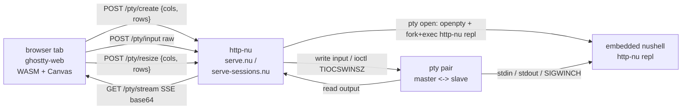

# ghostty-web-nu

[ghostty-web](https://github.com/coder/ghostty-web) ->
[http-nu](https://github.com/cablehead/http-nu) ->
[Nushell](https://www.nushell.sh): the
[Ghostty](https://github.com/ghostty-org/ghostty) VT100 emulator in a browser
tab, talking to an embedded Nushell REPL over SSE.

https://github.com/user-attachments/assets/a87f9bc1-2005-412d-bfa7-831e888fd4ab

## Run

You need the `pty` branch of http-nu -- it ships the `pty open`/`pty write`/
`pty resize`/`pty stream`/`pty close` commands plus the `repl` subcommand that
the embedded path execs into.

```sh
git clone --branch pty https://github.com/cablehead/http-nu.git
cd http-nu && cargo build
```

Then in this repo:

```sh
git clone https://github.com/cablehead/ghostty-web-nu.git
cd ghostty-web-nu
npm install        # pulls ghostty-web; www/ symlinks point into node_modules/
```

Single-pane:

```sh
/path/to/http-nu :5002 ./serve.nu --watch
```

Multi-session 2-pane:

```sh
/path/to/http-nu :5003 ./serve-sessions.nu --watch
```

Open `http://localhost:500{2,3}`. Each browser tab gets its own embedded `nu`
REPL.

`GHOSTTY_WEB_NU_CMD=bash` (or any other command) bypasses the embedded path
and execs the named binary instead.

## How it hangs together



Per browser tab:

1. `POST /pty/create {cols, rows}` -- mints a `sid`; http-nu calls `pty open`
   which `openpty()`s and `fork+exec`s `http-nu repl` (the embedded path) or
   whatever `cmd` was given (the exec path). Returns `{sid}`.
2. `GET /pty/stream?sid=...` -- SSE response, each frame
   `data: <base64-of-pty-output>\n\n`. ghostty-web decodes and writes into the
   WASM terminal.
3. `POST /pty/input?sid=...` (raw body) -- written verbatim to the pty master.
4. `POST /pty/resize?sid=...` `{cols, rows}` -- `master.resize()` which the
   kernel propagates to the slave with SIGWINCH.
5. `POST /pty/delete?sid=...` -- kills the child, drops the master fd.

The pty session map lives in the http-nu process. Each `sid` keeps a
`portable_pty::MasterPty` + `Child` for the lifetime of the tab. The browser
holds the `EventSource` so multiple ghostty-web instances on the page can each
own a sid.

## Two surfaces

| File | What it serves |
| --- | --- |
| `serve.nu` + `www/index.html` | Single-pane terminal. Whole canvas is one REPL. |
| `serve-sessions.nu` + `www/sessions.html` | Multi-pane. Left list of sessions, right pane shows the selected one. New: `Opt+N`. Switch: `Opt+J` / `Opt+K`. Close: `Opt+D` or the `x` on the row. |

Both pages use the same `/pty/*` endpoints.

## Why "embedded"

`pty open --embedded` (which `serve.nu` uses when `cmd=="nu"`) execs http-nu
itself with the `repl` subcommand. That gives the REPL all of http-nu's custom
commands (`.append`, `.cat`, `.static`, `.mj`, `pty open`, ...) at a real nu
prompt, with no separate `nu` binary needed.

Earlier versions of this used a `fork+evaluate_repl` (no-exec) path. That
worked for built-ins but silently dropped output from external commands
(`^ls`, `^cat`, ...) because http-nu's multi-threaded Rust runtime broke
nushell's `tcsetpgrp` dance on spawn. The self-re-exec path sidesteps it.

## Resize gotchas

A live window drag fires `window.resize` per animation frame, and
`fit.observeResize()` reacts to each one with a synchronous WASM-buffer +
canvas reallocation. Left on, the browser tab freezes. Both `index.html` and
`sessions.html` skip `fit.observeResize()` and use a hard-debounced
`window.resize` listener instead.

Embedded nushell also disables OSC 133 / 633 shell-integration sequences (in
the `repl` subcommand bootstrap). ghostty-web's WASM VT parser doesn't
recognize nushell's `133;P;k=r` variant and warns; in older ghostty-web
versions it could eat subsequent bytes and visibly truncate output.

## Test

```sh
cd test
node resize-browser.mjs       # chromium, hammer resizes, check responsive
ENGINE=webkit node resize-browser.mjs
```

The test boots its own isolated http-nu instance on a random port and drives a
real browser through the same SSE/fetch path the user does.

## License

MIT.
