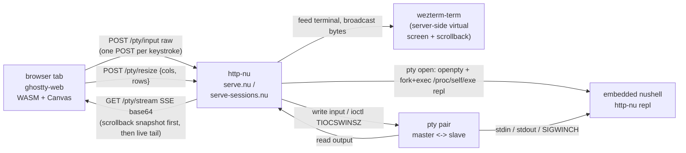

# ghostty-web-nu

The [Ghostty](https://github.com/ghostty-org/ghostty) VT100 emulator
([ghostty-web](https://github.com/coder/ghostty-web)) in a browser tab,
talking to an embedded [Nushell](https://www.nushell.sh) REPL over SSE.
[http-nu](https://github.com/cablehead/http-nu) bridges the browser to a
pty and runs the REPL; a server-side [wezterm-term](https://github.com/wez/wezterm)
stands in for the browser terminal -- tracking screen + scrollback so a
reattach replays clean, and answering VT queries from the pty when no
client is attached.


## Run

You need the `pty-wezterm-term` branch of http-nu -- it ships the `pty`
command set and the `repl` subcommand that the embedded path execs into.

```sh
git clone --branch pty-wezterm-term https://github.com/cablehead/http-nu.git
cd http-nu && cargo build --release
```

Then in this repo:

```sh
git clone https://github.com/cablehead/ghostty-web-nu.git
cd ghostty-web-nu
```

The three ghostty-web runtime files (`ghostty-web.js`, `ghostty-vt.wasm`,
`__vite-browser-external-*.js`) are vendored into `www/` so a fresh clone runs
without `npm install`. See `www/VENDORED.md` for how to refresh them when you
want a newer ghostty-web release.

Single-pane:

```sh
/path/to/http-nu :5002 ./serve.nu --watch
```

Multi-session 2-pane:

```sh
/path/to/http-nu --datastar :5003 ./serve-sessions.nu --watch
```

Open `http://localhost:500{2,3}`. Each browser tab gets its own embedded `nu`
REPL.

`GHOSTTY_WEB_NU_CMD=bash` (or any other command) bypasses the embedded path
and execs the named binary instead -- useful for isolating "is this nu vs
something else" while debugging.

## Two surfaces

| File | What it serves |
| --- | --- |
| `serve.nu` + `www/index.html` | Single-pane terminal. Whole canvas is one REPL. |
| `serve-sessions.nu` + `www/sessions.html` | Multi-pane. Sidebar of sessions, focused pane on the right. Tabs sort by most-recent input; a hard refresh lands on the tab you were last typing in. A server-wide title sits in the topbar; the focused pane's `cols x rows` mirrors into the status footer. |

Both pages use the same `/pty/*` endpoints; the sessions surface adds
`/sse` and `/nav` on top for the projected session list.

Sessions keymap:

| Key | Action |
| --- | --- |
| `Alt+T` | New session |
| `Alt+D` | Close current session |
| `Alt+J` / `Alt+K` | Cycle to next / previous |
| `Alt+R` | Rename current tab (stored as pty meta) |
| `Alt+Shift+R` | Rename the window title (persisted in `stor`) |
| `Cmd+C` | Copy current selection (ghostty-web's auto-copy-on-mouseup is disabled) |
| `` Cmd+` `` | Falls through to the OS window switcher |

## How it hangs together



The pty session map lives in the http-nu process. Each `sid` keeps a
`portable_pty::MasterPty` + `Child` + a `wezterm_term::Terminal` (canonical
virtual screen + scrollback) + a single-slot output sender (see below).

### Endpoints

Single-pane (`serve.nu`):

- `POST /pty/create` -- `{cols, rows}` body, returns `{sid}`.
- `POST /pty/input?sid=` -- raw body written verbatim to pty master. Served
  by a Rust fast-path in http-nu (no nu handler invocation); bumps the
  session's `last_input_ms` and emits a `touched` `pty.events` entry when
  the bump moves a sid to the head of the list.
- `POST /pty/resize?sid=` -- `{cols, rows}` -> `master.resize()` + SIGWINCH.
- `GET  /pty/stream?sid=` -- SSE: first frame is a snapshot of the full
  scrollback + visible screen, serialized as canonical VT bytes with SGR
  colors and attributes preserved. Subsequent frames are live pty output.
  Each frame: `data: <base64>\n\n`.

Sessions (`serve-sessions.nu`) adds:

- `GET  /sse` -- projected UX state. Bootstraps the session list, then
  emits `datastar-patch-elements` and `datastar-patch-signals` deltas in
  response to `pty.events` (created / died / resized / meta / touched) and
  `nav.events` (this conn's current selection). The selected sid is also
  patched into the `$selectedSid` signal so visibility-driven SSE reconnects
  land on the same tab.
- `POST /nav` -- publishes `{connId, sid}` to `nav.events`.
- `POST /pty/new` -- spawn a fresh session and select it for the requesting
  conn (`pty open --embedded` by default; honors `GHOSTTY_WEB_NU_CMD`).
- `POST /pty/close?sid=` -- kill child, drop master, publish `deleted`.

## Server-side terminal state

The server tees every pty read into a `wezterm_term::Terminal` and into a
single output channel:

- **Last-attach-wins.** A new `/pty/stream` attach replaces whatever sender
  was installed; the previous SSE drains and closes. There's at most one
  active consumer per sid. (Reattach UX: open the same URL again, the older
  tab quietly stops receiving.)
- **Scrollback snapshot on attach.** Before live bytes start flowing, the
  server walks the terminal's scrollback + visible screen and emits a
  canonical VT byte sequence (SGR colors + attributes preserved) that
  reproduces both history and the current cursor. An attach mid-session
  lands clean: no stale DSR queries, no partial sequences, no out-of-order
  mode toggles, and the user can scroll back into the history that
  predates them.
- **Scrollback cap surfaced to the client.** http-nu caps wezterm-term's
  scrollback (via `TerminalConfiguration`) and exposes the limit as
  `$HTTP_NU.pty_scrollback_lines`. `serve-sessions.nu` threads it into the
  page so the browser-side `Terminal({scrollback})` matches what the
  server actually retains.
- **Initial size sync.** On attach, the browser pushes `/pty/resize` with
  its current term dimensions, so the pty matches the visible viewport from
  byte zero rather than running at the open-time 80x24.
- **DA1/DA2 fallback when no subscriber.** If the program emits a device-
  attributes query (`ESC[c`, `ESC[>c`) while no client is attached, the
  reader thread injects the canonical reply back into the pty stdin so the
  program doesn't block on a reply that has nowhere to come from. Mirrors
  zmx's [`respondToDeviceAttributes`](https://github.com/neurosnap/zmx/blob/main/src/util.zig).
  When a client is attached, the browser's own VT emulator answers and the
  server stays out of the way.
- **Direct per-keystroke input.** `term.onData` POSTs each chunk straight
  to `/pty/input`. The Rust fast-path makes the round-trip cheap enough on
  localhost that no coalescing earns its added latency. A trailing-edge
  20ms coalescer (`sendInputCoalesced` in `sessions.html`) is kept dormant
  alongside the direct path for A/B feel-testing.
- **Scroll preservation.** ghostty-web's `Terminal.write()` force-scrolls
  to the bottom on every call. `sessions.html` wraps it to keep your
  position when you've scrolled up; new output appends silently below the
  viewport until you scroll back to the bottom.

### Debug dump

`HTTP_NU_PTY_DUMP=/tmp/pty.log` on the server makes the reader thread
append each pty chunk in escaped form (`\e`, `\r`, `\n`, `\xNN`) to that
file. Useful for pinning down "did nu actually emit those bytes" type
questions without disturbing the live browser.

## Embedded REPL

`pty open --embedded` execs `/proc/self/exe` with the `repl` subcommand --
http-nu re-runs itself rather than resolving its binary by name, so
swapping the binary during a dev rebuild doesn't strand existing children.
The REPL inherits all of http-nu's custom commands (`.append`, `.cat`,
`.static`, `.mj`, `pty open`, ...) at a real nu prompt, no separate `nu`
binary needed.

The bootstrap in the `repl` subcommand (in http-nu's `src/main.rs`):

1. Ignores SIGTTOU/SIGTTIN/SIGTSTP/SIGQUIT so spawned externals can
   `tcsetpgrp` cleanly.
2. Loads the nushell standard library (`std`, `std-rfc/*`).
3. Evaluates the bundled default env, runs `nu_engine::convert_env_values`
   so `$env.PATH` is a real list (and `ENV_CONVERSIONS` is wired up), then
   layers `~/.config/nushell/env.nu` and `~/.config/nushell/config.nu` on
   top -- the same order stock nushell uses.
4. Restores `nu_cli::Print` (http-nu's `PrintCommand` shadows it and routes
   to the http log; not what you want at an interactive REPL).
5. Hands off to `nu_cli::evaluate_repl`.

Earlier versions used a `fork+evaluate_repl` (no-exec) path. That worked
for built-ins but silently dropped output from external commands (`^ls`,
`^cat`, ...) because http-nu's multi-threaded Rust runtime broke nushell's
`tcsetpgrp` dance on spawn. The self-re-exec path sidesteps it.

## Resize gotchas

A live window drag fires `window.resize` per animation frame, and
`fit.observeResize()` reacts to each one with a synchronous WASM-buffer +
canvas reallocation. Left on, the browser tab freezes. Both `index.html`
and `sessions.html` skip `fit.observeResize()` and use a hard-debounced
`window.resize` listener instead.

## Test

```sh
cd test
node resize-browser.mjs       # chromium, hammer resizes, check responsive
ENGINE=webkit node resize-browser.mjs
```

The test boots its own isolated http-nu instance on a random port and
drives a real browser through the same SSE/fetch path the user does.

## License

MIT.
